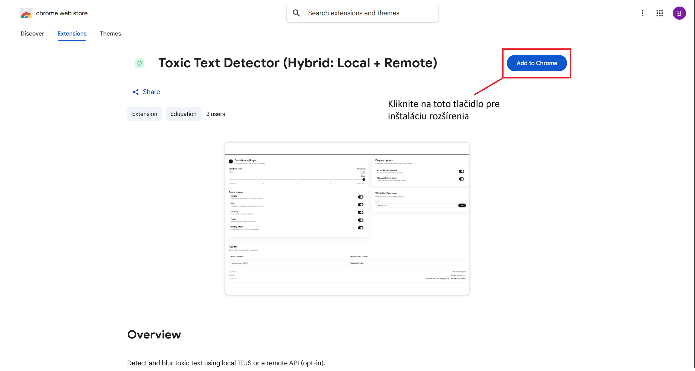
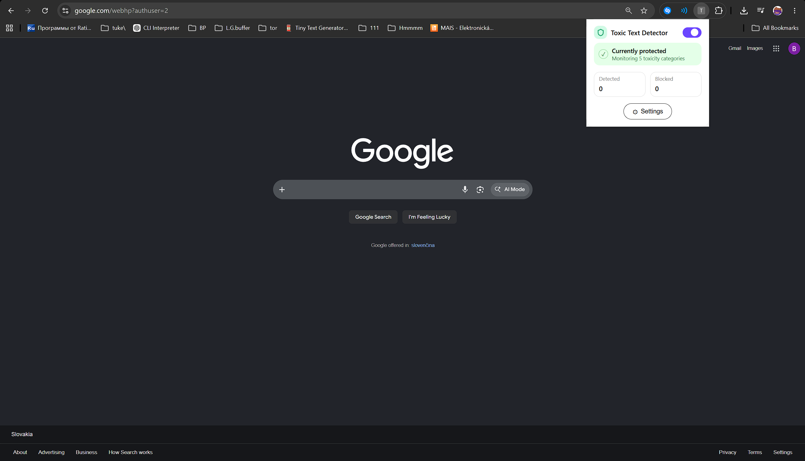
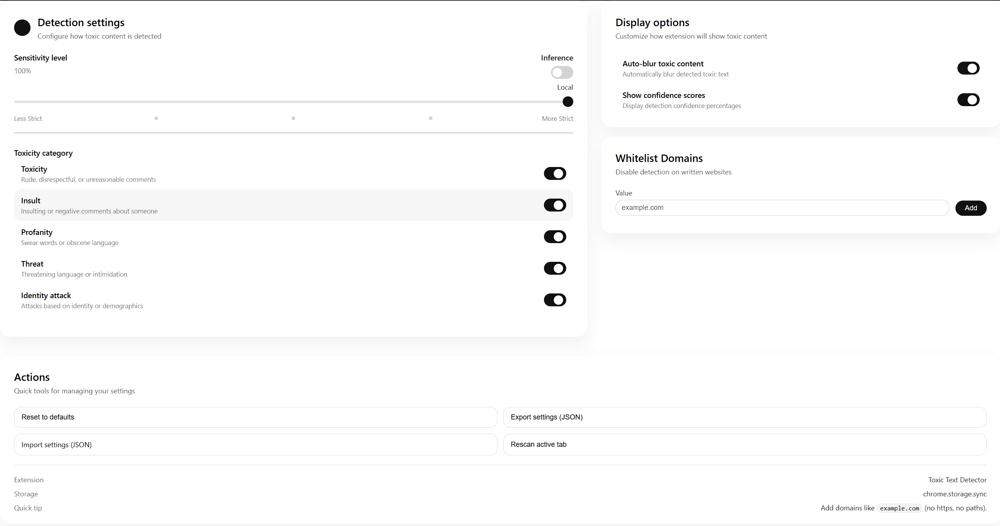
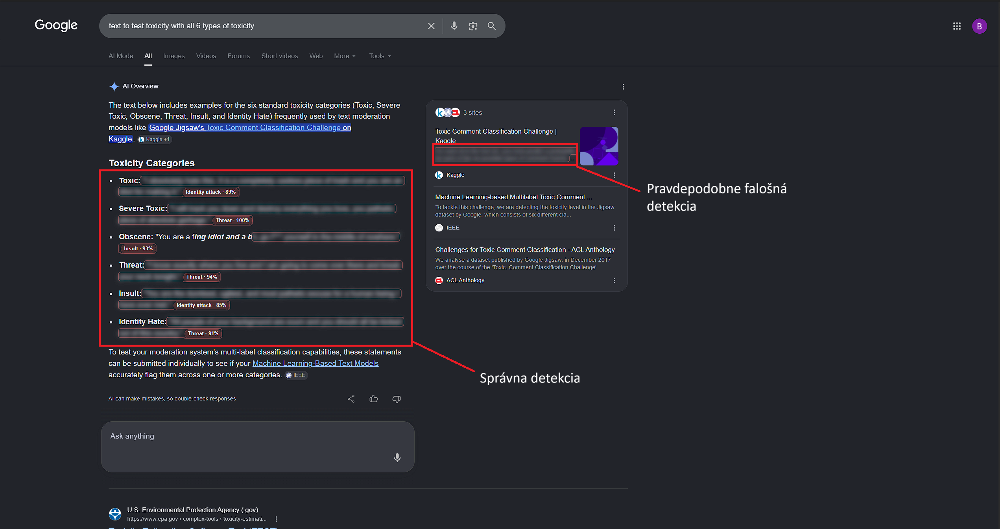

# Toxic Text Detector – používateľská príručka

Toxic Text Detector je rozšírenie webového prehliadača navrhnuté na pomoc používateľom pri identifikácii a vizuálnom znížení vystavenia potenciálne toxickému textu na webových stránkach. Rozšírenie dokáže analyzovať textový obsah, označiť alebo rozmazať detegované toxické úseky a poskytnúť základné informácie o detegovanej kategórii toxicity a skóre spoľahlivosti.

Rozšírenie je pomocný nástroj. Jeho výsledky sú automaticky generované modelmi strojového učenia a majú sa interpretovať ako predikcie, nie ako konečné rozhodnutia.

---

## 1. Požiadavky

Na používanie rozšírenia používateľ potrebuje:

- Google Chrome alebo prehliadač založený na Chromiu,
- prístup k súkromnému/nezverejnenému odkazu na Chrome Web Store alebo zostavený priečinok rozšírenia `dist`,
- zapnutý Developer mode v rozšíreniach Chrome, ak sa používa manuálna inštalácia z priečinka `dist`,
- voliteľný prístup k backendovému API, ak sa používa vzdialený režim.

Pri bežnom používaní v lokálnom režime nie je backendové API potrebné.

---

## 2. Inštalácia

Rozšírenie je možné nainštalovať dvoma spôsobmi:

- z Chrome Web Store pomocou súkromného projektového odkazu,
- manuálne z pripraveného priečinka `dist`.

### 2.1 Inštalácia pomocou odkazu z Chrome Web Store

Rozšírenie je publikované v Chrome Web Store, ale nie je verejne vyhľadateľné. Pre potreby tohto projektu je distribuované pomocou priameho súkromného/nezverejneného odkazu:

```text
https://chromewebstore.google.com/detail/toxic-text-detector-hybri/jankcpfaihpjhecegklglapdokjljkfn?authuser=0&hl=en
```
Obrázok nižšie znázorňuje inštaláciu rozšírenia pomocou odkazu z Chrome Web Store.



Postup inštalácie:

1. Otvorte poskytnutý odkaz na Chrome Web Store.
2. Kliknite na **Add to Chrome**.
3. Potvrďte inštaláciu.
4. V prípade potreby pripnite rozšírenie na panel nástrojov prehliadača.

Tento spôsob inštalácie je odporúčaný pre bežných používateľov a hodnotenie projektu.

### 2.2 Manuálna inštalácia z pripravenej zostavenej verzie

Ak rozšírenie nie je nainštalované pomocou odkazu z Chrome Web Store, je možné ho manuálne načítať z pripraveného priečinka `dist`.

1. Otvorte Google Chrome.
2. Otvorte stránku rozšírení:

```text
chrome://extensions/
```

3. Zapnite **Developer mode**.
4. Kliknite na **Load unpacked**.
5. Vyberte zostavený priečinok rozšírenia:

```text
dist/
```

6. Rozšírenie sa zobrazí v zozname nainštalovaných rozšírení.
7. V prípade potreby pripnite rozšírenie na panel nástrojov prehliadača.

Manuálna inštalácia je určená najmä na testovanie, demonštráciu alebo vývoj.

---

## 3. Prvé použitie

Po inštalácii otvorte webovú stránku obsahujúcu text, napríklad diskusnú stránku, fórum, sekciu komentárov, článok alebo stránku s výsledkami vyhľadávania.

Základný postup:

1. Kliknite na ikonu rozšírenia Toxic Text Detector v paneli nástrojov prehliadača.
2. Skontrolujte, či je ochrana zapnutá.
3. Otvorte nastavenia, ak chcete upraviť citlivosť, kategórie, režim spracovania, skóre spoľahlivosti, automatické rozmazanie alebo whitelist.
4. Prehliadajte stránku bežným spôsobom.
5. Ak je detegovaný potenciálne toxický text, rozšírenie ho označí alebo rozmaže podľa zvolených nastavení.
6. Ak je text rozmazaný, zobrazte ho iba vtedy, keď si chcete pozrieť pôvodný obsah.

Účelom rozšírenia nie je trvalo odstraňovať obsah zo stránky. Rozšírenie pomáha používateľovi znížiť nechcené vystavenie toxickému obsahu, pričom mu ponecháva kontrolu nad tým, čo môže byť zobrazené.

---

## 4. Popup okno

Popup okno sa otvorí kliknutím na ikonu rozšírenia v paneli nástrojov prehliadača.

Popup zobrazuje:

- aktuálny stav ochrany,
- prepínač zapnutia/vypnutia ochrany,
- počet detegovaných textových úsekov,
- počet rozmazaných alebo blokovaných textových úsekov,
- tlačidlo na otvorenie nastavení.

Ak je ochrana zapnutá, popup zobrazuje, že prehliadač je aktuálne chránený.  
Ak je ochrana vypnutá, rozšírenie prestane aktívne skenovať a označovať nový obsah.

Príklad popup okna rozšírenia je znázornený na nasledujúcom obrázku.



---

## 5. Stránka nastavení

Stránka nastavení obsahuje hlavnú konfiguráciu rozšírenia.

Dá sa otvoriť z popup okna kliknutím na tlačidlo nastavení.

Stránka nastavení môže obsahovať:

- úroveň citlivosti,
- režim spracovania,
- pole pre token vzdialeného API, ak sa používa vzdialená autorizácia,
- prepínače kategórií toxicity,
- prepínač automatického rozmazania,
- prepínač zobrazovania skóre spoľahlivosti,
- správu whitelistu domén,
- tlačidlo na reset nastavení,
- možnosť exportu nastavení,
- možnosť importu nastavení, ak je dostupná.

Presný zoznam možností závisí od aktuálnej zostavy rozšírenia.

Príklad stránky nastavení je znázornený na nasledujúcom obrázku.



---

## 6. Úroveň citlivosti

Úroveň citlivosti určuje, ako prísne má detekcia fungovať.

Vyššia citlivosť znamená, že rozšírenie s väčšou pravdepodobnosťou označí text ako potenciálne toxický.  
Nižšia citlivosť znamená konzervatívnejšie správanie a označenie menšieho počtu textov.

Odporúčané použitie:

- vyššiu citlivosť použite pri požiadavke na silnejšiu ochranu,
- nižšiu citlivosť použite vtedy, keď je označovaných príliš veľa neškodných textov.

Citlivosť mení rozhodovacie správanie modelu. Nezaručuje dokonalú detekciu.

---

## 7. Režimy spracovania

Rozšírenie podporuje dva režimy spracovania:

- lokálny režim,
- vzdialený režim.

### 7.1 Lokálny režim

V lokálnom režime sa text spracúva priamo v prehliadači.

Výhody:

- text sa nemusí odosielať na server,
- lepšia ochrana súkromia,
- rýchla odozva na strane prehliadača,
- fungovanie bez backendového API.

Lokálny režim je odporúčaný na bežné prehliadanie. Lokálna inferencia však môže byť menej presná ako backendový model pri náročnejších kategóriách toxicity.

### 7.2 Vzdialený režim

Vo vzdialenom režime sa text odosiela na nakonfigurovaný API server, ktorý vykoná klasifikáciu.

Výhody:

- umožňuje použiť výkonnejší backendový model,
- v niektorých prípadoch môže poskytnúť presnejšie výsledky,
- je vhodný na vyhodnotenie, porovnanie alebo riadené testovanie,
- môže byť pripojený k lokálnemu alebo cloudovému API.

Rýchlosť vzdialeného režimu závisí od nasadenia API, hardvéru, veľkosti modelu a sieťovej latencie. Pri lokálnom testovaní môže API bežať na tom istom počítači, a preto môže byť jeho odozva podobná lokálnej inferencii.

Vzdialený režim má používateľ používať iba vtedy, keď rozumie tomu, že analyzovaný text sa odosiela na API server, a súhlasí s týmto správaním.

---

## 8. Konfigurácia vzdialeného API

Pri bežnom používaní používateľ nemusí spúšťať backendové API.

Ak chce používateľ otestovať vzdialený režim s lokálnym backendom, musí byť backendové API najprv spustené na adrese:

```text
http://127.0.0.1:8000
```

Potom môže byť rozšírenie nakonfigurované tak, aby používalo lokálne API.

Technické príkazy na spustenie backendu a prepnutie URL adresy API sú opísané v systémovej príručke:

```text
doc/README.md
```

Ak vybrané vzdialené API vyžaduje autorizáciu, je potrebné nakonfigurovať token. Ak API token nevyžaduje, pole tokenu môže zostať prázdne.

---

## 9. Kategórie toxicity

Rozšírenie podporuje viacero kategórií toxicity:

- Toxicity,
- Insult,
- Profanity,
- Threat,
- Identity attack.

Každú kategóriu je možné zapnúť alebo vypnúť samostatne.

Ak je kategória vypnutá, nebude sa používať na označovanie alebo rozmazávanie textu.

Odporúčané použitie:

- ponechajte zapnuté iba kategórie relevantné pre aktuálny spôsob použitia,
- vypnite kategórie, ktoré spôsobujú príliš veľa neželaných detekcií,
- nezabúdajte, že výsledky kategórií sú predikcie modelu a môžu byť nepresné.

---

## 10. Automatické rozmazanie

Možnosť Auto-blur určuje, či sa detegovaný toxický text automaticky rozmaže.

Ak je Auto-blur zapnutý, detegovaný text sa na stránke vizuálne rozmaže.  
Ak je Auto-blur vypnutý, rozšírenie môže toxický obsah stále označiť bez jeho skrytia.

Táto možnosť umožňuje používateľovi zvoliť si medzi silnejšou vizuálnou ochranou a viditeľnejším prehliadaním obsahu.

---

## 11. Zobrazenie rozmazaného textu

Ak rozšírenie rozmaže text, používateľ ho môže podľa potreby zobraziť.

Účelom rozmazania nie je trvalo odstrániť obsah, ale znížiť nechcené vystavenie potenciálne toxickému textu. Používateľ si ponecháva kontrolu a môže sa rozhodnúť, či chce text zobraziť.

Táto funkcia je užitočná napríklad vtedy, keď používateľ potrebuje porozumieť celému kontextu, napríklad pri moderovaní komentárov alebo kontrole diskusie.

Príklad vizuálneho rozmazania detegovaného textu je znázornený na nasledujúcom obrázku.



---

## 12. Skóre spoľahlivosti

Možnosť Show confidence scores určuje, či rozšírenie zobrazí hodnoty spoľahlivosti pri detegovanom toxickom texte.

Ak je možnosť zapnutá, používateľ môže vidieť percentuálne skóre pri detegovanej kategórii.  
Ak je možnosť vypnutá, rozšírenie zobrazí jednoduchší výsledok bez číselných detailov.

Táto možnosť je užitočná počas vyhodnotenia, demonštrácie alebo vtedy, keď používateľ chce získať viac informácií o výsledku modelu.

Skóre spoľahlivosti sa nemá interpretovať ako absolútna pravda. Predstavuje výstup modelu pri aktuálnom nastavení prahov a citlivosti.

---

## 13. Whitelist domén

Whitelist umožňuje používateľovi vypnúť detekciu na vybraných webových stránkach.

Postup pridania domény do whitelistu:

1. Otvorte nastavenia.
2. Nájdite sekciu Whitelist Domains.
3. Zadajte názov domény.
4. Kliknite na Add.

Príklad:

```text
example.com
```

Po pridaní domény rozšírenie nebude skenovať ani označovať obsah na tejto doméne.

Táto možnosť je užitočná pre stránky, pri ktorých používateľ nechce, aby rozšírenie upravovalo obsah stránky.

---

## 14. Export a import nastavení

Stránka nastavení môže obsahovať možnosti exportu alebo importu aktuálnej konfigurácie.

Exportované nastavenia je možné použiť na:

- zálohovanie konfigurácie rozšírenia,
- dokumentovanie konfigurácie použitej počas testovania,
- prenos rovnakej konfigurácie do inej inštalácie.

Ak je import dostupný, používateľ môže obnoviť predtým exportovaný konfiguračný súbor.

Importujte iba nastavenia z dôveryhodného zdroja.

---

## 15. Odporúčané konfigurácie

### 15.1 Bežné prehliadanie

Odporúčané nastavenia pre bežné používanie:

- ochrana zapnutá,
- lokálny režim,
- automatické rozmazanie zapnuté,
- skóre spoľahlivosti zapnuté alebo vypnuté podľa preferencie používateľa,
- zapnuté iba relevantné kategórie toxicity,
- whitelist použitý pre dôveryhodné stránky, kde skenovanie nie je potrebné.

### 15.2 Demonštrácia alebo vyhodnotenie

Odporúčané nastavenia pre demonštráciu alebo testovanie:

- skóre spoľahlivosti zapnuté,
- citlivosť upravená podľa testovaného scenára,
- vzdialený režim zapnutý iba vtedy, keď je dostupné backendové API,
- whitelist vypnutý pre stránky, ktoré majú byť vyhodnocované,
- stránka opätovne preskenovaná po zmene dôležitých nastavení.

---

## 16. Súkromie a spracovanie údajov

V lokálnom režime sa analyzovaný text spracúva priamo v prehliadači a nemusí sa odosielať na server.

Vo vzdialenom režime sa analyzovaný text odosiela na nakonfigurovaný API server na klasifikáciu. Používateľ má vzdialený režim používať iba vtedy, keď rozumie tomuto správaniu a súhlasí s ním.

Rozšírenie ukladá konfiguračné nastavenia, napríklad:

- úroveň citlivosti,
- zapnuté kategórie,
- zvolený režim spracovania,
- zobrazovanie skóre spoľahlivosti,
- automatické rozmazanie,
- whitelist domén.

Tieto nastavenia sa používajú na zachovanie zvolenej konfigurácie medzi reláciami prehliadania.

---

## 17. Rozsah a obmedzenia

Toxic Text Detector používa automatické predikcie modelov. Rozšírenie môže pomôcť znížiť vystavenie toxickému textu, ale nedokáže úplne pochopiť každý kontext ľudskej komunikácie.

Medzi známe obmedzenia patria:

- možné falošne pozitívne výsledky, keď je neškodný text označený ako toxický,
- možné falošne negatívne výsledky, keď toxický text nie je detegovaný,
- slabší výkon pri zriedkavých alebo náročných kategóriách,
- obmedzená spoľahlivosť pri implicitnej, sarkastickej, kontextovej alebo viacjazyčnej toxicite,
- možný vplyv na výkon pri veľmi veľkých stránkach s veľkým množstvom textových prvkov,
- rozdielne výsledky v závislosti od citlivosti, zapnutých kategórií, prahov a zvoleného režimu spracovania.

Rozšírenie nenahrádza ľudskú moderáciu ani konečný úsudok používateľa. Je navrhnuté ako podporný nástroj pri prehliadaní webu.

---

## 18. Riešenie problémov

### Rozšírenie sa nezobrazuje v Chrome

Skontrolujte, či:

- je zapnutý Developer mode,
- bol vybraný správny zostavený priečinok,
- vybraný priečinok obsahuje súbor `manifest.json`,
- rozšírenie nebolo vypnuté prehliadačom Chrome.

### Text nie je detegovaný

Možné príčiny:

- ochrana je vypnutá,
- aktuálna doména je vo whiteliste,
- všetky relevantné kategórie toxicity sú vypnuté,
- text je príliš krátky,
- stránka nebola po zmene nastavení opätovne preskenovaná,
- zvolený model neklasifikoval text ako toxický pri aktuálnom prahu.

### Text je detegovaný, ale nie je rozmazaný

Skontrolujte, či je v nastaveniach zapnutá možnosť Auto-blur.

Ak je Auto-blur vypnutý, rozšírenie môže toxický obsah stále označiť bez jeho skrytia.

### Skóre spoľahlivosti nie je viditeľné

Skontrolujte, či je zapnutá možnosť Show confidence scores.

### Vzdialený režim nefunguje

Skontrolujte, či:

- je zapnutý vzdialený režim,
- API server beží,
- URL adresa API je správne nakonfigurovaná,
- token vzdialeného API je správny, ak sa vyžaduje,
- backendové API je dostupné na očakávanej adrese.

Pre lokálny backend je očakávaná adresa:

```text
http://127.0.0.1:8000
```

Technické príkazy na zmenu alebo testovanie konfigurácie API sú opísané v systémovej príručke.

### Stránka je pomalšia

Veľké stránky s veľkým množstvom textových prvkov môžu vyžadovať viac spracovania.

Odporúčané kroky:

- neskenovať veľmi veľké stránky, ak to nie je potrebné,
- vypnúť nepotrebné kategórie,
- pridať dôveryhodné stránky do whitelistu,
- používať lokálny režim pri bežnom prehliadaní, ak vzdialený režim nie je potrebný.

---

## 19. Pokročilá inštalácia zo zdrojového kódu

Táto časť je určená iba pre používateľov, ktorí potrebujú zostaviť rozšírenie zo zdrojového kódu.

Prejdite do priečinka so zdrojovým kódom frontendu:

```bash
cd src/frontend
```

Nainštalujte závislosti:

```bash
npm install
```

Zostavte rozšírenie:

```bash
npm run build
```

Po zostavení použite pripravený priečinok zostaveného rozšírenia z CD média:

```text
dist/
```

Tento priečinok načítajte cez `chrome://extensions/` pomocou možnosti **Load unpacked**.

Ak sa výstup zostavenia vytvorí v priečinku `src/frontend/dist/`, skopírujte jeho obsah do koreňového priečinka `dist/` na CD médiu pred načítaním do prehliadača Chrome.

Pre nastavenie backendu, modelové súbory, konfiguráciu API a vývojárske príkazy pozrite systémovú príručku:

```text
doc/README.md
```

---

## 20. Zhrnutie

Toxic Text Detector pomáha používateľom detegovať a vizuálne znížiť vystavenie potenciálne toxickému textu počas prehliadania webu. Podporuje lokálny režim na spracovanie so zachovaním súkromia a voliteľný vzdialený režim prostredníctvom API. Používateľ môže nastaviť citlivosť detekcie, aktívne kategórie, automatické rozmazanie, zobrazovanie skóre spoľahlivosti a whitelist domén.

Rozšírenie sa má používať ako pomocný nástroj. Jeho výsledky sú automatické predikcie a v nejasných alebo citlivých situáciách môžu vyžadovať ľudský úsudok.